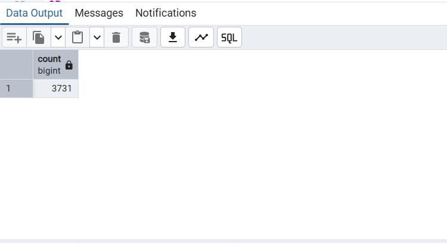
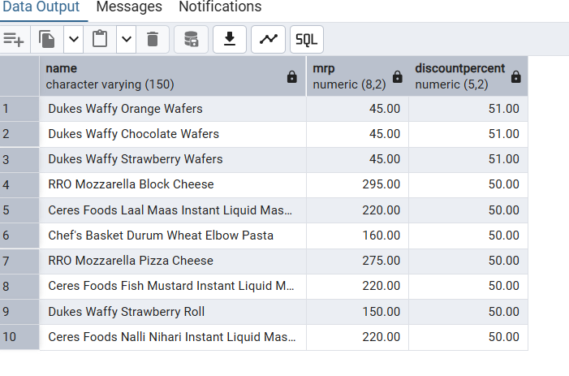
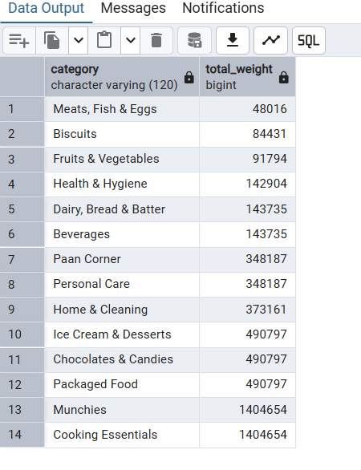

# zepto-sql-analysis-snehitha-2026
# 🛒 Zepto SQL Data Analysis Project

## 📌 Project Overview

This project analyzes product data from Zepto, a quick-commerce grocery delivery platform, using SQL.
The goal is to extract meaningful business insights related to product pricing, discounts, inventory, and category performance.

---

## 📊 Key Objectives

* Understand product distribution across categories
* Identify products with the highest discounts
* Analyze inventory distribution
* Evaluate pricing efficiency (price per gram)
* Generate actionable business insights using SQL

---

## 🛠 Tools & Technologies Used

* PostgreSQL
* SQL
* pgAdmin 4

---

## 📂 Dataset

The dataset used in this project is:

* `zepto.csv` → Contains product-level data including category, price, discount, stock, and weight

---

## 🧹 Data Cleaning Steps

* Removed products with zero price
* Converted price values from paise to rupees
* Checked for null values
* Verified data consistency

---

## 🔍 SQL Analysis Performed

### 1. Total Number of Products

```sql
SELECT COUNT(*) FROM zepto;
```

### 2. Top Discounted Products

```sql
SELECT name, mrp, discountPercent
FROM zepto
ORDER BY discountPercent DESC
LIMIT 10;
```

### 3. Inventory Distribution by Category

```sql
SELECT category,
SUM(weightInGms * availableQuantity) AS total_weight
FROM zepto
GROUP BY category
ORDER BY total_weight DESC;
```

---

## 📸 Query Results

### 🔢 Total Products



### 💸 Top Discounted Products



### 📦 Category Inventory Analysis



---

## 🔎 Key Insights

* Some product categories contribute significantly more to total inventory
* A small number of products offer very high discounts
* Inventory distribution is uneven across categories
* Pricing efficiency varies significantly between products

---

## 📁 Project Files

* `zepto_project.sql` → SQL queries and analysis
* `zepto.csv` → Dataset
* `total_products.png` → Total product count output
* `top_discounts.png` → Top discount analysis
* `category_inventory.png` → Category inventory analysis
* `README.md` → Project documentation

---

## ▶️ How to Use

1. Download the dataset (`zepto.csv`)
2. Import it into PostgreSQL
3. Run the SQL queries from `zepto_project.sql`
4. Explore the results and insights

---

## 👩‍💻 Author

**Snehitha**

Aspiring Data Analyst passionate about data analysis, SQL, and business insights.
